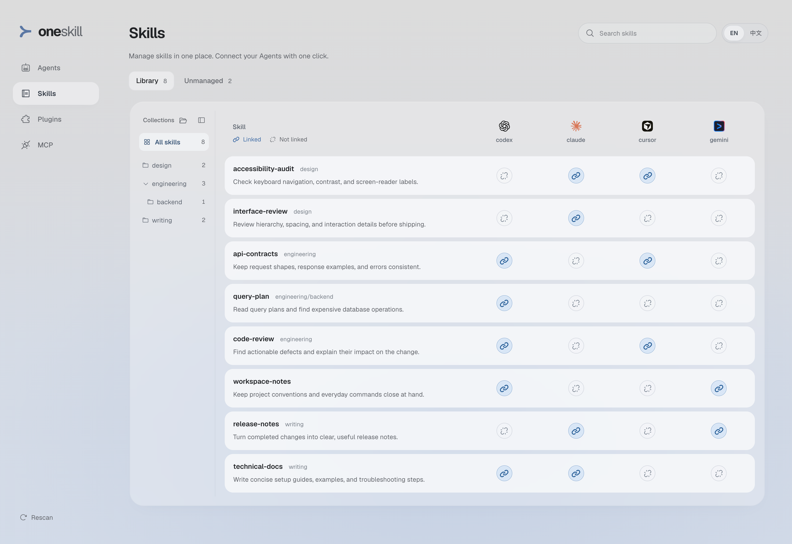
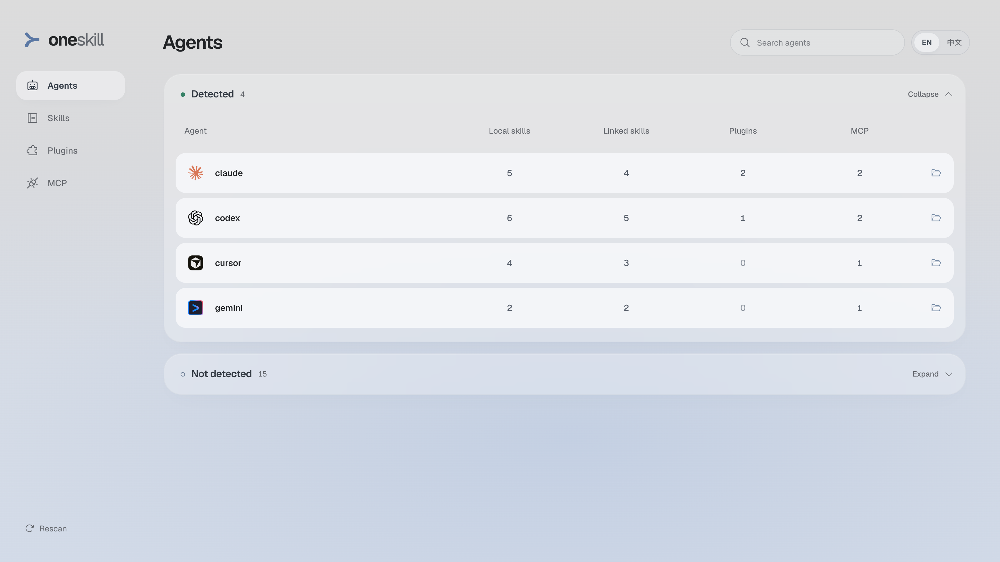

# oneskill

**One skill library, connected to your Agents.**

**English** · [简体中文](README.zh-CN.md)

oneskill is a local-first skill manager for coding Agents. Keep your skills in one library, organize them with ordinary folders, and choose which Agents can use each one.

## Why oneskill

Working with several Agents often means maintaining several skill directories. A useful skill gets copied into Codex, Claude Code, or another tool; its next revision leaves those copies out of step. Switching Agents means finding and arranging the same material again.

oneskill gives those skills a shared home. Each Agent connects to the same source through a symbolic link, so changes stay in one place. You can see the connections, add or remove them individually, and keep Agent-specific packages where they belong.

The desktop Web UI and CLI share the same filesystem state. No cloud account or database is required; the interface supports English and Simplified Chinese.

## A library you control

- **Files are the library.** A folder containing `SKILL.md` is a skill package. Edit it with your usual tools; its scripts, references, and other assets stay alongside it.
- **One source, visible connections.** Update the shared package once. Each linked Agent reads those files, and unlinking an Agent leaves the source intact.
- **Folders define collections.** Group related skills in parent folders, including nested collections. Your organization lives in the filesystem rather than separate tags.
- **Adopt what is useful.** Bring existing packages into the library with backups and conflict checks. Ignore packages that should remain local to an Agent, and restore them to the list when needed.

```text
oneskill/skills/code-review/            shared source
    ▲
    ├── ~/.agents/skills/code-review     symbolic link
    └── ~/.claude/skills/code-review    symbolic link
```

Connections point to the source package. oneskill manages those connections without maintaining a separate copy for every Agent.

## Preview

**A shared library with visible connections.** Browse a collection, inspect a skill, and choose its Agents from the same workspace.



**An overview of your local Agents.** See discovered skills, library links, native plugins, and MCP configuration together.



Screenshots use the included sample workspace. Explore it with `npm run demo`.

## Quick start

Requires **Node.js 20+**, npm, and a desktop browser.

```bash
git clone https://github.com/zyfn/oneskill.git
cd oneskill
npm ci
npm start
```

## From scattered skills to a shared library

### 1. Bring skills together

Add a package containing `SKILL.md` to `skills/`, or open **Skills → Unmanaged** to review packages already present in your Agent directories. **Manage here** imports the complete package and links it back to its original Agent, so that Agent can continue using it.

The original package is backed up before its location becomes a link. If a destination contains different content, oneskill reports the conflict instead of overwriting it.

### 2. Organize by folder

Use the same structure you would use for any collection of files:

```text
skills/
├── engineering/
│   ├── code-review/SKILL.md
│   └── backend/query-plan/SKILL.md
├── writing/
│   └── technical-docs/SKILL.md
└── workspace-notes/SKILL.md
```

The collection tree follows these folders. Expand branches as needed, select a parent to include its descendants, or collapse the navigation to give the library more room. **All skills** includes every package, including those directly under `skills/`.

After adding or reorganizing folders, **Rescan** the workspace. Unlink a package before changing its path, then reconnect it at the new location.

### 3. Connect the Agents you use

The library's Agent columns show **Linked** and **Not linked**. Select a connection to change it. A skill can be available to several Agents, one Agent, or none; it stays in the library in every case.

Linking creates a symbolic link in the selected Agent's skill directory. Unlinking removes that link and preserves the shared package.

### 4. Keep the library intentional

Update a shared skill in place so its linked Agents read the same revision. Use search and collections to focus on the skills you need, and inspect a package's details or open its folder when editing.

Unmanaged packages do not all need to be adopted. **Ignore** keeps a package out of the review list without changing its files or Agent access. This choice persists across scans and restarts; **Ignored → Restore** brings it back.

## Beyond the skill library

The **Agents** view brings the detected local environment into one overview. **Plugins** and **MCP** provide searchable, read-only inventories, with an Agent filter and source details. These views help you understand what each Agent has alongside the skills you share.

## Compatibility

The catalog records command names, official configuration conventions, and compatibility locations for Codex, Claude Code, Cursor, Gemini CLI, Qwen Code, and other Agents. Shared rules are declared once, with explicit macOS and Windows configuration roots. Add custom Agents or override presets in `agents.local.json`; see the [local definition example](agents.local.example.json). Changes take effect on rescan. Legacy Skill target overrides in `agents.registry` remain supported, and shared skill directories may be read by several Agents.

CLI entries are detected only when `--version` exits successfully with a recognized version. Failed checks remain visible with their error code. Desktop and extension entries confirm installation metadata only; they do not establish runtime health. Qoder desktop and Qoder CLI are separate entries. Configuration directories are scanned independently and never prove installation. Skill loading follows each Agent's own rules. See [Agent discovery](docs/agent-discovery.md) for detection methods and limits, or the [reference](docs/reference.md) for skill directories and scan coverage.

## CLI

Use the same library and link operations from a terminal:

```bash
npm run cli -- skills --json
npm run cli -- link codex engineering/code-review
npm run cli -- unlink codex engineering/code-review
npm run cli -- validate
```

Run `npm run cli -- help` for available commands, or see the [CLI reference](docs/reference.md#cli).

## Development

```bash
npm --prefix web ci
npm run dev          # API and built UI
npm run dev:web      # Vite development server, in another terminal
npm run check        # Syntax checks, tests, and production build
```

The frontend uses React, Vite, and Tailwind CSS. The scanner, filesystem operations, HTTP API, and CLI live in `src/`; the interface lives in `web/src/`.

Contributions are welcome, especially Agent discovery improvements, platform verification, and focused interaction refinements. Include sanitized fixtures for scanner changes, verify both interface languages for UI changes, and run `npm run check` before submitting a pull request.

## Documentation

- [Configuration, storage, and import recovery](docs/reference.md)
- [Design conventions](docs/design.md)
